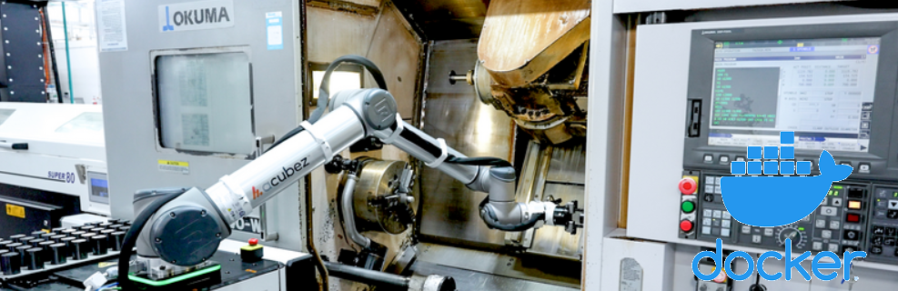

# UR-Docker

A Universal Robots e-Series sandbox: a Dockerized PolyScope simulator (URSim
5.26 LTS) plus **`urctl`** — a zero-dependency Python toolkit that drives the
simulator and real robots over the same wire protocols. Every capability is
exposed four ways — **MCP server** (for agents), **web GUI**, **CLI**, and
**Python library** — and every mutating action passes through a safety
envelope and lands in an audit log.

Runs on Windows, macOS, and Linux (amd64/arm64). The simulator needs Docker;
the toolkit needs only Python ≥ 3.10.

## Quick start

```bash
git clone https://github.com/Olympus-Controls/UR-utils && cd UR-utils
docker compose up -d          # start the simulator (PolyScope UI: http://localhost:6080/vnc.html)
uv sync                       # or: pip install .
uv run urctl bring-up         # cold start -> RUNNING (power + brakes)
uv run urctl state            # robot state as JSON
```

Open the PolyScope UI via the **localhost** URL above — not the IP printed in
the container log. `make simx-up` starts the PolyScope X (PolyScope 10) sim
instead; see CLAUDE.md for its different remote surface.

Point any command at a real robot with `--host <ip>` (or `UR_HOST=<ip>`) —
nothing else changes. **One real-robot gate:** motion requires the pendant's
top-right indicator set to *Remote*; in *Local* it silently no-ops
(`urctl state` shows `control_mode`).

## For agents: MCP

`urctl-mcp` serves 20 schema-validated, safety-enveloped, audited tools over
MCP stdio — state, deep telemetry, motion, IO, programs, and
`ur_system_snapshot` (the full cell model: joints/calibration, active TCP,
named IO, program inventory). Pure stdlib, no SDK to install.

```json
{ "mcpServers": { "ur": { "command": "urctl-mcp", "args": ["--host", "10.0.0.5"] } } }
```

`urctl tools` prints the same registry as JSON schemas for any other agent
framework; `urctl call <tool> --json '{...}'` dispatches one from the shell.
Add `--dry-run` anywhere to validate + audit without sending.

## For humans: the cockpit GUI

```bash
uv run perception --cell ur3 gui          # RGB-D cockpit + Pilot panel (docs/realsense.md)
uv run perception --fake gui              # the same on a synthetic scene, no camera
```

A local web cockpit (binds 127.0.0.1): the wrist camera's colour + depth, extra
webcam views, hover-to-measure, click-to-segment, send-the-point-to-the-robot,
hand-eye calibration, and a Pilot panel (bring-up, jog, stop, freedrive,
gripper) whose every button goes through the same audited tool registry.

## CLI + library

```bash
urctl move-joints 0 -1.57 0 -1.57 0 0        # safety-validated movej
urctl move-tcp 0 0.05 0 0 0 0 --relative     # nudge +50 mm along base +Y
urctl rtde-state --deep                      # full drivetrain telemetry
urctl snapshot                               # everything about the robot (JSON)
urctl guided MyProgram --save MyProgram.urp  # build a program step-by-step,
                                             #   operator confirms on the pendant
```

```python
from urctl import Robot, RobotConfig

with Robot(RobotConfig(host="10.0.0.5")) as robot:
    robot.bring_up()
    robot.move_joints([0, -1.0, 1.2, -1.8, -1.57, 0])
    print(robot.rtde_state(deep=True))
```

## What's inside

| Path | What it is |
| ---- | ---------- |
| `urctl/` | The toolkit: `Robot` facade, Dashboard/Primary/RTDE clients, safety envelope, audit log, tool registry, MCP server, GUI, guided program builder, `.urp`/`.installation` codecs, SSH/docker introspection |
| `perception/` | Camera → pick-pose helpers: RealSense RGB-D capture + cockpit (`perception gui`, zero deps via ctypes; see `docs/realsense.md`), monocular stubs, optional OpenCV/SAM extras |
| `hardware/` | Printable tool-flange bracket for the D435 (parametric CadQuery + spec) |
| `programs/` | Sample PolyScope programs with their build scripts |
| `scripts/` | Standalone helpers (`urp_convert.py`, `poweron.sh`) |
| `docs/harness.md` | Architecture reference: every read/control surface and how the GUI/MCP sit on them |
| `CLAUDE.md` | The deep lore: protocol map, URScript dialect traps, URP schema, real-vs-sim divergences |

## Development

```bash
make help                # all targets
uv run pytest -m "not integration"   # unit tests (no simulator needed)
make test-integration    # tests that drive a running URSim
make lint                # ruff + shellcheck
```

CI runs lint, unit tests across Windows/macOS/Linux (amd64 + arm64), a
packaging smoke test, and CodeQL on every PR; label a PR `run-integration` to
boot URSim in CI too. Dependabot keeps dependencies, action pins, and
simulator images current.

## The pilot's seat (RealSense on a UR3e / UR20)

`scripts/cockpit.sh ur20` (macOS/Linux) or `scripts\cockpit.ps1 -Cell ur20`
(Windows) opens the RGB-D cockpit for one *cell*; `make doctor CELL=ur20` is
the pre-flight; `.mcp.json` hands an agent the same camera + robot tools.
Walkthrough and field log: `docs/realsense-cell.html`; reference:
`docs/realsense.md`.
