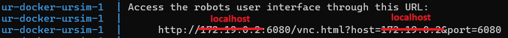

# UR-Docker

A sample container for Universal Robot testing and development.

## Prerequisites

* Linux - [Docker](https://docs.docker.com/engine/install/ubuntu/)
* Windows - [Docker Desktop](https://docs.docker.com/desktop/install/windows-install/)

## Usage (Linux)

Start the simulator:

```bash
git clone https://github.com/Olympus-Controls/UR-Docker
cd UR-Docker
sudo docker compose up -d --build
```

Then open your browser and connect to: [http://localhost:6080/vnc.html?host=localhost&port=6080](http://localhost:6080/vnc.html?host=localhost&port=6080)

NOTE: Do NOT connect at the IP address in the container output. You must use localhost.



To shut down the simulator:

```bash
sudo docker compose down
```
