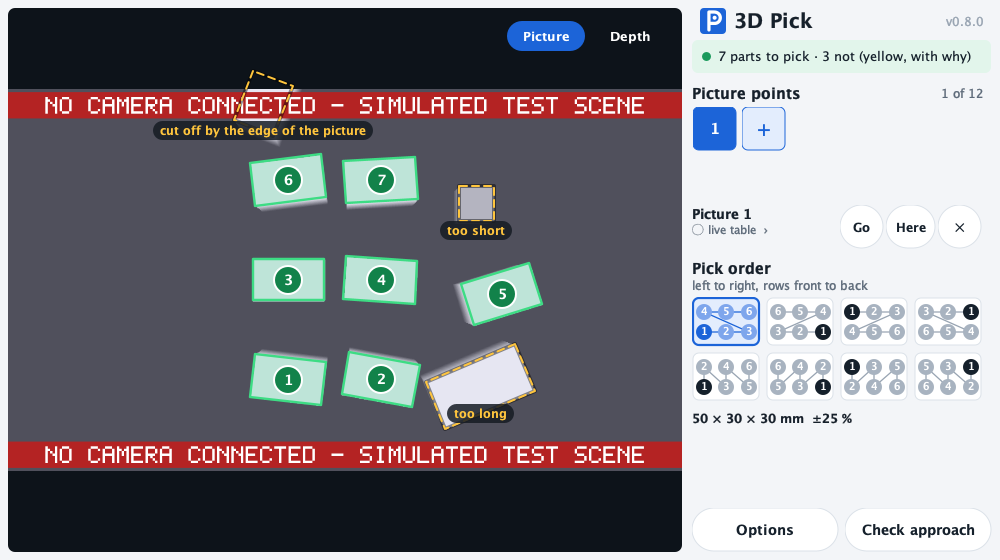
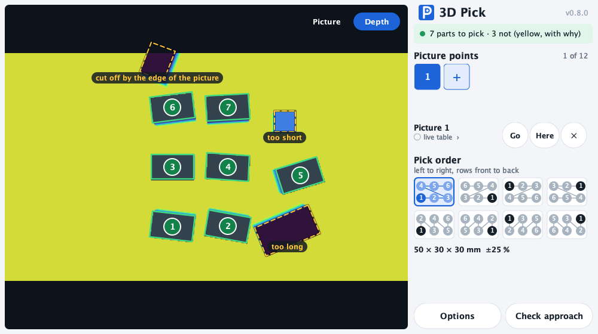
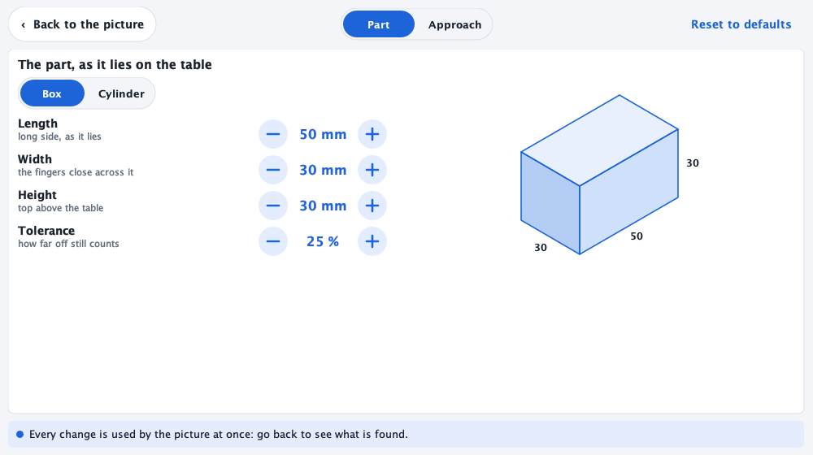
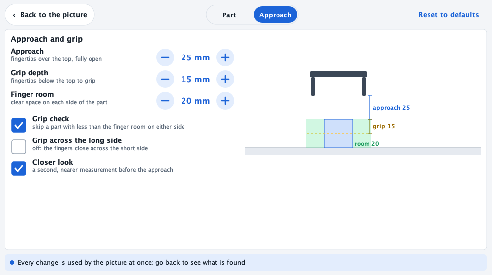
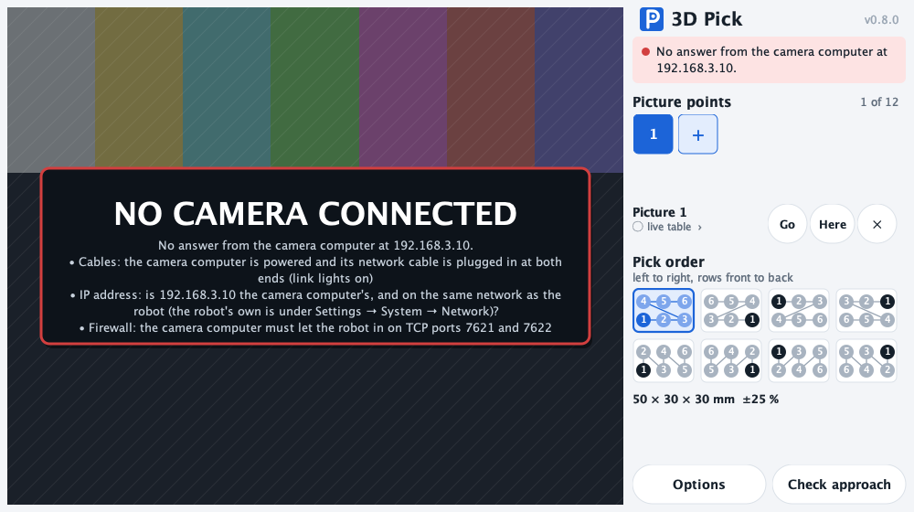
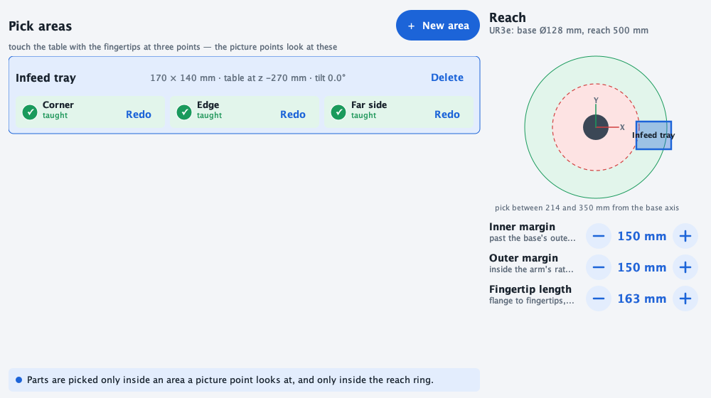

#  Perceptronic for PolyScope 5 (e-Series)

Vision-guided picking for an e-Series robot on PolyScope 5, with a RealSense D435 on the
wrist and a small camera computer beside the robot (`deploy/pi/`). Two nodes and a button:

- **3D Pick** (Program tab → URCaps): one move sequence — it surveys from any number of
  picture points, finds the part by its size, and puts the tool at the grip on the next
  one in the order you choose. It never touches the gripper: your program opens it before
  the node and closes it after.
- **Perceptronic** (Installation tab → URCaps): the camera computer's address, the live
  feed (tap a point, send the arm there), and the **pick areas** taught with the
  fingertips, on a map of the arm's reach.
- **The P button** in PolyScope's header (a toolbar contribution, the way Robotiq's gripper
  button works): tap it on any screen and the live picture drops down in a popup, with the
  frame rate and the camera computer's address; tap again to close. It reads the address
  the Installation node saved, so there is nothing to set up.

The mark — a P with a lens in its bowl — is [`../perceptronic.svg`](../perceptronic.svg);
the same glyph is the toolbar button, every screen's header and a faint watermark on the
Installation's and the popup's live picture (`Logo.java` draws it with Java2D; a test holds
it equal to the SVG).

Download: [`../dist/perceptronic-ps5-0.8.0.urcap`](../dist/perceptronic-ps5-0.8.0.urcap)

## Install on the robot

You need a USB stick and nothing else: no tools, no command line. Two files matter, both in
[`../dist/`](../dist/):

| File | What it is |
| --- | --- |
| [`perceptronic-ps5-0.8.0.urcap`](../dist/perceptronic-ps5-0.8.0.urcap) | The URCap. Always needed. |
| [`urmagic_perceptronic.sh`](../dist/urmagic_perceptronic.sh) | Optional. Lets the robot install the URCap by itself when the stick goes in (B below). |

### 1. Put the files on a stick

1. Use a stick formatted **FAT32** (most sticks up to 32 GB already are; exFAT and NTFS are
   not read by the pendant).
2. **Download** each file: open the link above, then press the **Download raw file** button
   (the arrow at the top right of the file view). Do not copy-and-paste the text of the
   `.sh` file into an editor — Windows editors change its line endings and it stops working.
3. Copy the file(s) to the **top level** of the stick — not inside a folder — and do not
   rename them. The `.sh` file names the `.urcap` file and its checksum, so the two must
   come from the same download; take both again whenever you update.
4. Eject the stick properly (Windows: right-click the drive → **Eject**; Mac: drag it to the
   Trash) before pulling it out. A stick pulled early can hold a half-written file.

On a Mac, Finder also writes hidden `._…` companions next to each file. They are harmless
except that PolyScope's file picker lists `._perceptronic-ps5-0.8.0.urcap` too — pick the
one **without** `._`. `scripts/urcap5-usb.sh` does the whole of this step without them.

### 2A. Install by hand on the pendant (always works)

1. Plug the stick into the pendant.
2. Tap ☰ (top right) → **Settings** → **System** → **URCaps**.
3. Tap **+**, tap `perceptronic-ps5-0.8.0.urcap`, tap **Open**.
4. Tap **Restart** when PolyScope asks.
5. After the restart: **Installation** tab → **URCaps** → **Perceptronic**.

### 2B. Or let the stick install it

1. Once per robot: ☰ → **Settings** → **Security** → **General** → enable **Run magic
   files** (and **USB ports**).
2. Power the arm **off** (the robot stays on; the arm's status is "Power off") and make sure
   no program is running.
3. Plug the stick in. The pendant shows **! USB !** while it works, then the robot restarts
   by itself.
4. After the restart: **Installation** tab → **URCaps** → **Perceptronic**.

If the arm was powered on or a program was running, nothing restarts: a popup says
"restart the robot to load it" — do that when it suits. If nothing happens at all, use 2A,
then plug the stick into a computer and read `urmagic_perceptronic.log` on it.

**Upgrading from RealSense Pilot (≤ 0.5.0)?** The URCap was renamed on 2026-09-29 and is a
different bundle (`io.advin.perceptronic`, vendor Nick Armenta — was
`com.olympuscontrols.realsensepilot`; builds from 2026-09-29/30 were
`com.nickarmenta.perceptronic`, also a different bundle): PolyScope treats it as a second URCap, so remove
**RealSense Pilot** (Settings → System → URCaps → select it → −) before or after adding
this one, and type the cockpit address and teach the pick areas again — the old node's
saved data and any program's **RealSense Pick** nodes belong to the old bundle.

**Upgrading from 0.6.0 / 0.7.0?** Same bundle, so the installation's address and pick areas
stay. The program node is called **3D Pick**, has **no children** and (0.8.0) **does not
drive the gripper**: put your gripper's Open before it and its Close after it. A node saved
by 0.6.0 keeps its picture points, part size and order, but what you had inside it — the
routine after the pick, or your own gripper nodes — must move to after the node
(`If rs_pick_found` …); how PolyScope opens a saved node whose children are no longer allowed has not been
tried. The camera computer must be updated too (it serves the depth view and the reach by
kinematics); an older one still works, with the 0.6.0 checks.

### Or let the stick install it

### How the stick installs it

`urmagic_perceptronic.sh` is `scripts/urmagic_perceptronic.sh` with the jar's file name,
sha256 and bundle id filled in (`make urcap5-package` writes the copy in `dist/`; a test
holds it equal; `scripts/urcap5-usb.sh` writes the same file on the stick). PolyScope 5 runs every `urmagic_*.sh` at the
top level of a USB stick as root when the stick goes in, if **Settings → Security → General
→ Run magic files** (and **USB ports**) is enabled — the pendant shows **! USB !** while it
runs. The script checks the file's sha256, copies it to `/root/.urcaps/<bundle id>.jar`
(where PolyScope's own URCaps screen installs to, and what it re-installs from at every
start), logs to the robot's log and to `urmagic_perceptronic.log` on the stick, and
**restarts the controller only while the arm is powered off and no program runs** —
otherwise it pops up "restart the robot to load it". Plugged in again (or left in) it does
nothing once the same build is installed. Source: `scripts/urmagic_perceptronic.sh`
(`URMAGIC_RESTART=never|always` in its header changes the restart rule). **Not yet run on
a pendant** — the `/root/.urcaps` path is read out of PolyScope's own installer
(`URCapsServiceImpl`) and UR's remotetcp URCap, which installs itself the same way; 2A
remains the fallback.

PolyScope X runs nothing from a stick. The same stick carries `perceptronic-<ver>.urcapx`
for System Manager, and `scripts/urcapx-autoinstall.sh <robot-ip>` installs it over the
network as soon as the robot answers (from the pick PC at boot, say).

## The cockpit it talks to

The node is a client of the RealSense cockpit (`perceptronics gui`) running on the computer
the camera is plugged into. The controller reaches it over the cell network, so start it
listening on the network:

    perceptronics --cell ur3 gui --bind 0.0.0.0

and type `http://<that-computer's-ip>:7621` into **Cockpit** (the pendant keyboard opens
when you tap the field), then **Save** — it is kept in the installation. No `--cors` is
needed: the node is Java on the controller, not a web page.

## What is the same as PolyScope X, and what is not

| PolyScope X node | PolyScope 5 node |
| --- | --- |
| live dot, fps, Cockpit field + Save, feed, status, located target | same |
| hover for depth, click to segment → locate | same (hover works with a mouse; on the touchscreen, tap) |
| **Move (PolyScope)**: PolyScope's IK + auto-move screen | PolyScope's hold-to-move screen, sent the **controller's own joint solution** (`joint_target` from locate: `get_inverse_kin` with the TCP forced to the flange) — no IK through an active TCP the cockpit may disagree about |
| Move (cockpit), Bring up, STOP, Clear | same |
| Open cockpit (a browser tab) | removed — the pendant has no browser |
| — | **the P button** (PolyScope 5 only): the live picture in a popup over any screen |

Reach is judged by the controller's inverse kinematics (`get_inverse_kin_has_solution`)
when the cockpit can ask it, and by the datasheet radius only when it cannot; the target
text says which.

## Releases

Pushing a `urcap5-v<version>` tag (`git tag urcap5-v0.3.0 && git push fork urcap5-v0.3.0`)
publishes the committed `../dist/perceptronic-ps5-<version>.urcap`, its sha256 and the stick's
`urmagic_perceptronic.sh` (checked to be the one written for that jar) as a
GitHub Release (`.github/workflows/release-urcap5.yml`). The workflow does not rebuild the
jar — the URCap API jars are UR's and live only in the URSim image — it runs
`python3 urcap/urcap5.py release-check <tag>`: the tag's version is `Bundle-Version`, the
committed jar of that version exists, carries the current sources' digest, and passes
PolyScope 5's install checks; then the URCap tests. So: bump `Bundle-Version`, `make
urcap5-package`, commit `dist/`, then tag. The Python package's `v*` tags are a separate line.
## Try it on a desktop first

    python3 urcap/preview5.py                  # a simulated camera computer (a box scene)
    python3 urcap/preview5.py --shuffle 6      # ... re-scattering the parts every 6 s
    python3 urcap/preview5.py --cockpit http://192.168.3.10:7621   # the real one
    python3 urcap/preview5.py --snapshot out.png --view part       # one screen, no display

A 1280 × 800 window (the pendant's size) with the 3D Pick node's and the Installation node's
own screens: add picture points, tap the order tiles, switch the picture to depth, open
Options, teach pick areas. What is outlined is the real detector's answer. What only a robot
can do is stood in for (no arm moves; a pick area's touches are a sample rectangle; typed
values come from a dialog). Needs a JDK. The simulated picture is stamped **NO CAMERA
CONNECTED — SIMULATED TEST SCENE**.

## 3D Pick (0.8.0): survey, find the part by its size, go to the grip

*Rendered off-pendant from the same Swing classes (`PickScreen`), 1000 × 560, with a
ray-cast scene through the real detector (`python3 urcap/preview5.py --screens
urcap/perceptronic-ps5/screens` writes every picture on this page). The first look at it on
a pendant is still owed.*

**Program tab → URCaps → 3D Pick.** The node is **one line in the program — a move sequence
with no children** — and **it does not control the gripper at all**:

    Open gripper        ← your node
    3D Pick             ← survey … approach … down to the grip, fingers around the part
    Close gripper       ← your node
    If rs_pick_found    ← lift, place

`rs_pick_found` is True once the tool is at the grip; `rs_pick_loc` says which picture
point the part came from. Put it in a loop.

**Nothing on its screens scrolls.** The picture takes most of the screen, with two things
drawn on it: every part that **will be picked in green, with its number** in the pick order,
and every candidate that is nearly the part and **will not be in yellow, with why** —
`too long`, `too flat`, `2 parts touching?`, `out of reach (no joint solution)`,
`no room for a finger beside it`, `outside the pick area`, `cut off by the edge of the
picture`. What is nothing like the part (a clamp, a cable) gets no graphic.

**Picture / Depth** — the toggle at the picture's top right, inside its frame — switches the
stream between the camera's picture and the depth as a heatmap (near = violet, far =
yellow; the ramp spans what the frame holds):

Beside the picture, all an operator does day to day:

1. **Picture points** — up to 12, as a fixed grid of numbered buttons. Move the arm to where
   the camera sees the parts (≥ 0.3 m away: the D435 is blind closer) and tap **+**;
   PolyScope's own move screen confirms the position. Tap a number to select it: **Go**
   moves back there, **Here** retakes it, **✕** removes it, and its second line chooses the
   **pick area** it looks at (taught in the Installation, below) or the live table. The
   program visits the points in turn: an empty one sends the arm on to the next.
2. **Pick order** — eight tiles: left→right or right→left, rows front→back or back→front,
   or by columns. Front is the **bottom of the picture** as the pendant shows it. Tapping a
   tile renumbers the green parts at once.
3. **Options** — two tabs, and nothing about speeds or the gripper:

| Tab | Settings (default) |
| --- | ------------------ |
| **Part** | **Box** or **Cylinder**; length × width × height as it lies (50 × 30 × 30 mm) — a cylinder: diameter × height; tolerance (±25 %, never tighter than ±5 mm) |
| **Approach** | approach: fingertips 25 mm over the top; grip depth 15 mm; **Grip check** (on) with its **Finger room** (20 mm); **Grip across the long side** (off); **Closer look** (on) |

- **Cylinder**: standing on a flat end, a circle facing up (one lying on its side would
  roll). Found by its diameter; the wrist is not turned for it.
- **Grip check** (on) and **Finger room** (20 mm): a part is picked only if there is that
  much clear space on **each of the two sides the fingers come down on** — nothing standing
  higher than the grip depth within 20 mm of the part's edge. Set the room to what your
  fingers need; untick the check to pick however close the neighbours are. The node knows
  nothing about your gripper's opening: a part is never refused for being "too wide".
- **Grip across the long side** (boxes only; off): unticked, the fingers close across the
  part's **short** side; ticked, across its **long** side. The finger room is checked on
  whichever two sides that is.
- **Closer look** (on): before the approach the arm moves in for a second measurement — the
  camera 0.3 m from the part, the part held 12° off the middle of the picture on the side
  away from the gripper, so the fingers are not in front of it. Off, the approach uses the
  measurement from the picture point, and every part is measured from there (no part is
  taken from the last survey's queue).

**What is pickable is the arm's kinematics' answer.** The node names the arm
(`arm=UR3`); the camera computer solves the arm's inverse kinematics for the approach and
the grip (`perceptronics/armik.py` — straight down, then leaned 12° and 24°, the program's
own ladder) and leaves out only the parts with no joint solution, plus those inside the
base's keep-out (its outer radius + 150 mm). There is no reach ring to tune. In the program
the controller's own `get_inverse_kin_has_solution` has the last word (PolyScope 5.9.4+).

**What a run does:** force the TCP to the flange; ask the camera computer `NEXT` — a part
it already saw sends the arm **straight to the closer look** over it (no trip back to the
picture point); otherwise the survey: `movej` to the picture point, settle, `FIND`. The
closer look re-measures the part (`LOOK` → `REFINE`, leaning 12° / 24° only if the
controller's IK can't solve it straight down), then the approach (fingertips 25 mm over the
top) and down to the grip — **and the node ends there**, your TCP back,
`rs_pick_found = True`. A part with no joint solution sends it on to the next one.
Anything that stops short says why in a popup. The node travels at 60 % of its own limits.

**Open the gripper before the node.** It goes down with whatever opening the gripper has;
the finger room is checked against the picture, not against your fingers.

**The detector** (`perceptronics/volume.py`) is depth only — no colour threshold: a part is
what stands the part's height above the surface, with a top face the part's length ×
width. The surface is the picture point's **taught pick area** (its plane, nudged ≤ 15 mm to
the live table) or, without one, the table found live (level in the base frame). Each
part's minimum-area rectangle gives its centre and axes; the grasp is straight down, wrist
turned so the fingers close across the chosen side (a cylinder: the wrist stays as it is).

## When the camera computer does not answer

The picture's place says what to check, most likely first — **cables**, the **IP address**,
the **firewall** (TCP 7621 and 7622) — or, when the computer answers but has no picture, the
**camera's USB cable**. The exception, the URL and the command that starts the cockpit are
not on the screen: they go to the log (`Log.java`: the JVM's logger `perceptronic`; where
PolyScope files that on a pendant has not been checked).

## Installation: pick areas on the arm's reach

**Installation → URCaps → Perceptronic → Pick areas.** A pick area is a patch of the work
surface taught by **touching the table with the fingertips** at three points — its corner,
a point along one edge (that edge is the area's X), a point on the far side — each through
PolyScope's move screen. The node measures the fingertips from the flange (**Fingertip
length**, 163 mm for the UR3e's Hand-E + adapter) whatever TCP PolyScope has active. An
area tilted more than 2° from level is flagged: the table is flat, so tilt is a teaching
error (a touch on a part, not the table). Only the selected area is open (its three
touches); up to eight fit the screen.

The map draws the base, **how far this arm reaches** (its rated reach, named on its
circle), the keep-out round the base and every taught area — an area that goes past the
reach is flagged. There are no reach margins to set: which parts can be picked is the
kinematics' answer, part by part.

## The wire (pick server protocol 2)

One line per request, one parenthesised list per answer (URScript's
`socket_read_ascii_float`). Every request carries the node's options:
`part=50x30x30 tol=25 [shape=cyl] order=LR,FB grip=15 approach=25 gripcheck=1 room=20
[across=long] [arm=UR3] [plane=p[…] area=300x200] node=<id> loc=<i> locs=<n> proto=2` (0.5 / 0.6 sent
`reach=<min>,<max>` instead of `arm=`; the server still honours it)
(`perceptronics/picknode.py` `parse_options`; the Java `PickScript.tokens` writes it, and a test
reads the Java's tokens back with the Python parser). Verbs: `NEXT` (the queue), `FIND`,
`LOOK`, `REFINE`, `LOG`. Answers: `(status, centre xyz, flange pose ×6, loc, order,
remaining, L, W, H)`. The teach screen asks `GET /api/pick/scene?opts=<the same tokens>`
(and `&approach_mm=` for **Check approach**, which answers the approach in PolyScope's
active TCP for its hold-to-move screen). The picture is `GET /api/color.png`, the depth view
`GET /api/depth.png` — both long-polled by sequence number.

## Build it

A JDK (11+; it builds Java 8 bytecode with `--release 8`) and a network — no Docker:

    make urcap5-sdk        # the URCap API jars of the oldest supported PolyScope (+ 5.8's) into target/
    make urcap5-package    # compile, write the manifest, zip → ../dist/*.urcap (commit it)

`urcap/urcap5.py` does what UR's Maven SDK would: `Import-Package` comes from the classes
(`jdeps`), the manifest carries the `URCapCompatibility-CB3` / `-eSeries` flags PolyScope
5's loader requires, and `META-INF/maven/**/pom.xml` names the `com.ur.urcap:api`
version (where PolyScope reads it). The API jars are UR's and are never committed: `sdk`
reads them out of the `universalrobots/ursim_e-series` image's layer straight from Docker
Hub's registry. The jar is reproducible, and carries a digest of its sources so a test
flags a stale `dist/` without a JDK.

**Backwards compatible by construction** (`bundle.properties`): the code is compiled against
the URCap API of the **oldest supported PolyScope, 5.4** (`compat.floor`; its
`polyscope-urcap/api-1.7.0.jar`, so `urcap.api.version=1.7.0` — PolyScope 5.10+ refuse a
URCap whose pom names a newer API than they carry). A call 5.4 lacks is a compile error,
not a `NoSuchMethodError` when an operator taps it on an old pendant. The one newer API the
node uses — `RobotPositionCallback2`, which says which TCP offset a taught pose is under,
first in 5.8 — lives in `TeachPosition2` (`compat.since.5.8`), compiled against 5.8's jars
and loaded by name only when the PolyScope has that class; its package is imported
`resolution:=optional`. Before 5.8 a pick-area touch takes the flange from the joints
through the arm's nominal geometry (UR3e/5e/10e/16e; `PoseMath.flange`, the rows of
`perceptronics/armfk.py`). `python3 urcap/urcap5.py check --sdk <dir>` holds the URCap to any
version's jars (`urcap5.py sdk --image 5.12.8 --dir <dir>`).

## Status (2026-10-01, 0.8.0)

- Compiles against PolyScope 5.4's URCap API (and each version's own, in the matrix) with
  `-Xlint:all -Werror`; the script, the option tokens, the order tiles, the plane and pose
  maths, the reach table and the scene parsing are tested against the Python they stand
  for, under a JDK (`tests/test_urcap5_pick.py`).
- The screens are pure Swing (no UR API) and render in a harness; a test lays each one out
  at two panel sizes with 0, 1 and 12 picture points and fails if any control is past the
  edge or a scroll pane exists. **Not yet seen on a pendant** — PolyScope's JVM crashes
  under emulation on the Mac, and CI checks the bundle and the script, not pixels.
- 0.7.0 / 0.8.0 have **not run on a robot**: the closer look's aim, the finger room, the
  long-side grip and the reach by kinematics are verified against ray-cast scenes and the
  arm's forward kinematics only.
- `get_inverse_kin_has_solution` / `get_inverse_kin` verified on the UR3e (PolyScope
  5.25.1).

## Tested PolyScope versions

**Every PolyScope 5 release UR publishes a URSim image for — 5.4 through 5.26, the newest
image of each minor — runs every change to the URCap**, in URSim on GitHub's amd64 runners
(`.github/workflows/urcap5-matrix.yml`; the version list is `urcap/ps5_matrix.py`'s MATRIX,
`docker-compose.ps5-matrix.yml` is generated from it). No version is excluded. Docker Hub has
nothing older than 5.4 (`universalrobots/ursim_e-series`, 2026-09-28).

| PolyScope | URSim image | Runs (Dashboard `PolyscopeVersion`) | URCap API it reports | Result |
| --------- | ----------- | ---------------------------------- | -------------------- | ------ |
| 5.4 | `ursim_e-series:5.4` | 5.4.3 | 1.7.0 | PASS |
| 5.5 | `ursim_e-series:5.5` | 5.5.1 | — | PASS |
| 5.6 | `ursim_e-series:5.6` | 5.6.0 | — | PASS |
| 5.7 | `ursim_e-series:5.7` | 5.7.0 | — | PASS |
| 5.8 | `ursim_e-series:5.8` | 5.8.2 | — | PASS |
| 5.9 | `ursim_e-series:5.9.4` | 5.9.4 | — | PASS |
| 5.10 | `ursim_e-series:5.10.2` | 5.10.2 | 1.12.0 | PASS |
| 5.11 | `ursim_e-series:5.11.11` | 5.11.11 | 1.13.0 | PASS |
| 5.12 | `ursim_e-series:5.12.8` | 5.12.8 | 1.14.0 | PASS |
| 5.13 | `ursim_e-series:5.13.1` | 5.13.1 | 1.14.0 | PASS |
| 5.14 | `ursim_e-series:5.14.6` | 5.14.6 | 1.14.0 | PASS |
| 5.15 | `ursim_e-series:5.15.2` | 5.15.2 | 1.14.0 | PASS |
| 5.16 | `ursim_e-series:5.16.1` | 5.16.1 | 1.15.0 | PASS |
| 5.17 | `ursim_e-series:5.17.3` | 5.17.3 | 1.15.0 | PASS |
| 5.18 | `ursim_e-series:5.18.1` | 5.18.1 | 1.15.0 | PASS |
| 5.19 | `ursim_e-series:5.19.0` | 5.19.0 | 1.16.0 | PASS |
| 5.20 | `ursim_e-series:5.20.0` | 5.20.0 | 1.16.0 | PASS |
| 5.21 | `ursim_e-series:5.21.3` | 5.21.3 | 1.17.0 | PASS |
| 5.22 | `ursim_e-series:5.22.2` | 5.22.2 | 1.17.0 | PASS |
| 5.23 | `ursim_e-series:5.23.0` | 5.23.0 | 1.17.0 | PASS |
| 5.24 | `ursim_e-series:5.24.0` | 5.24.0 | 1.19.0 | PASS |
| 5.25 | `ursim_e-series:5.25.2` | 5.25.2 | 1.19.0 | PASS |
| 5.26 | `ursim_e-series:5.26.1` | 5.26.1 | 1.19.0 | PASS |

All PASS in [run 36521908487](https://github.com/JimothyJohn/perceptronics/actions/runs/36521908487)
(2026-09-29): bundle Active with both node services, the API check, the pick e2e, the
compile probe and the timeout probe. "—": PolyScope 5.5-5.9 record no URCap API version and
read no pom (only 5.10+ gate on it).

Per version:

1. **API** — `urcap5.py check` against that image's own API jars: the sources it loads
   compile with `-Xlint:all -Werror`, and every package the committed jar imports (optional
   ones aside) is one it exports. A separate job rebuilds the committed jar against 5.4's
   jars (and 5.8's for `TeachPosition2`) with a *different* JDK (21; the committed jar is 25's)
   and holds it to the committed one with `urcap5.py compare` — the same entries, every
   non-class file byte-identical, every class declaring the same members; the sources digest
   holds the method bodies. The jar that ships is the floor build, whatever JDK built it.
2. **Load** — the committed `dist/` jar goes in `/urcaps`; PolyScope's own Felix shell (port
   6666 inside the container) must report the bundle Active with both node services, since
   polyscope.log never says a URCap started; any polyscope.log line or stack frame naming the
   URCap with a failure fails the run.
3. **Run** — the arm is brought up and the Pick node's own URScript, generated for that
   controller's PolyScope, runs three times against a pick server on the runner
   (`urcap/pick5_e2e.py`: survey → FIND → closer look → REFINE → the grip, then the second
   part from the queue, then once with the closer look off). No gripper is involved.
4. **Compile probe** — the script with the failure popup (which a sim can't run) inside `if False:` must compile on the controller; the control, a dead
   branch naming an undefined function, must not (it doesn't, on every version).
5. **Timeout probe** — a timed-out `socket_read_ascii_float` into a 17-element list must
   leave the program running (the node's "no answer" path).

What the older controllers needed (found by this matrix):

- **5.4-5.7**: no `RobotPositionCallback2` (first in 5.8's API). A pick-area touch takes
  the flange from the joints through the arm's nominal DH table (UR3e/5e/10e/16e) instead of
  PolyScope's TCP offset — nominal, not the robot's calibration (0.84 mm on the UR3e cell);
  an arm outside the table can't teach areas there (the table is then found live).
- **5.4-5.8.2**: no `get_inverse_kin_has_solution` (`compile_error_name_not_found`; 5.9.4
  has it, 5.9.0-5.9.3 have no image and count as without). The node reads its PolyScope and
  writes the close look and the straight-down approach unchecked: no lean ladder, and an
  unreachable pose stops the program with PolyScope's own IK error.
- **5.9.4-5.14.6**: a list keeps its first size ("Resizing of 'List' is not supported") —
  the close look's answer has its own variable; a test holds every read to one size.
- **5.5**: PolyScope answers `DISCONNECTED` for a moment after its Dashboard comes up and
  drops a `power on` sent then (a matrix-harness fix, not the URCap's).

What this does not cover: the node's screens rendering on a pendant, and the Installation
node's touch-to-teach on a pendant (TeachPosition's two paths are tested under a JDK
against stub APIs shaped like 5.4's and 5.8's).

The weekly job also reads the version each matrix image carries (its `VERSION` env, from the
registry) against `IMAGE_VERSIONS`: a tag re-pushed with other contents (the bare 5.4–5.8
tags say no patch) is drift. A weekly job fails when Docker Hub has a PolyScope 5 minor the matrix lacks, or a newer
image of one it has (`python3 urcap/ps5_matrix.py check-tags`: "PolyScope 5.27 exists
(...): add it"); the matrix only ever grows — a minor leaves it only through
`ps5_matrix.py`'s EXCLUDED, with its reason, and this table. On an amd64 Linux host:
`make urcap5-matrix PS5_VERSION=5.4` (or `all`).
