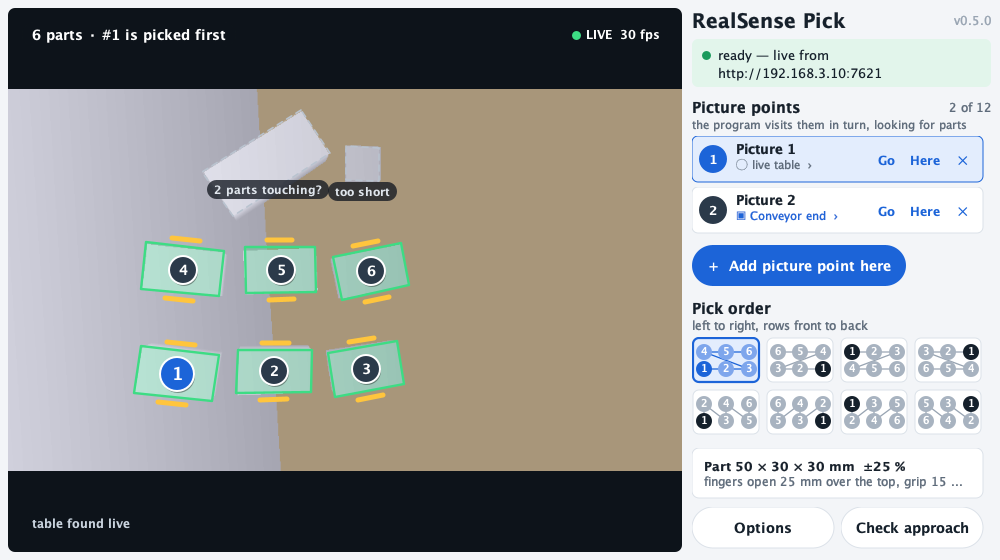
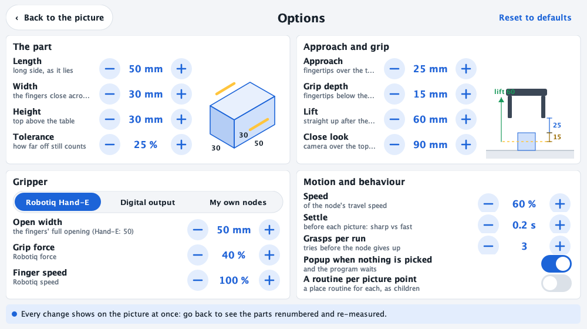
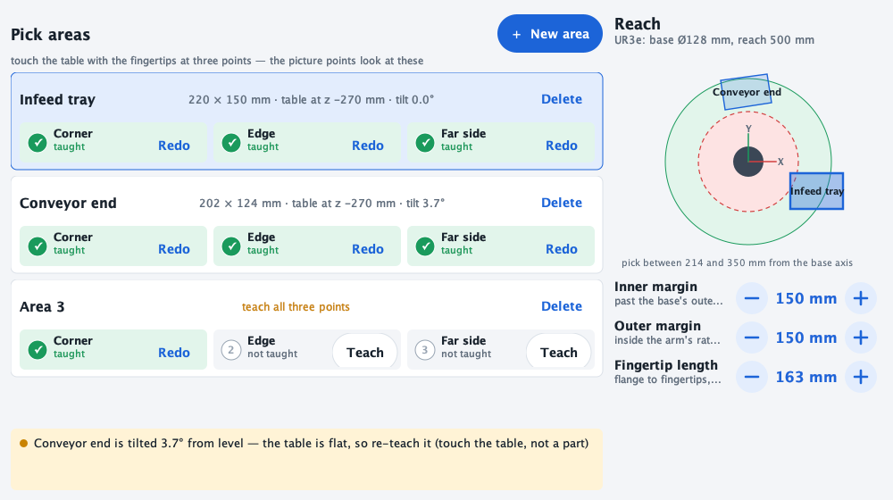

# RealSense Pilot for PolyScope 5 (e-Series)

Vision-guided picking for an e-Series robot on PolyScope 5, with a RealSense D435 on the
wrist and a small camera computer beside the robot (`deploy/pi/`). Two nodes:

- **RealSense Pick** (Program tab → URCaps): finds the part by its size in the picture from
  any number of picture points and picks the next one in the order you choose.
- **RealSense Pilot** (Installation tab → URCaps): the camera computer's address, the live
  feed (tap a point, send the arm there), the **pick areas** taught with the fingertips,
  and the **reach**.

Download: [`../dist/realsense-pilot-ps5-0.5.0.urcap`](../dist/realsense-pilot-ps5-0.5.0.urcap)

## Install on the robot

1. Copy `realsense-pilot-ps5-0.5.0.urcap` to a USB stick and plug it into the pendant.
2. Settings (☰ top right) → System → URCaps → **+** → pick the file → Open, then
   **Restart** when PolyScope asks.
3. Installation tab → URCaps → **RealSense Pilot**.

## The cockpit it talks to

The node is a client of the RealSense cockpit (`perception gui`) running on the computer
the camera is plugged into. The controller reaches it over the cell network, so start it
listening on the network:

    perception --cell ur3 gui --bind 0.0.0.0

and type `http://<that-computer's-ip>:7621` into **Cockpit** (the pendant keyboard opens
when you tap the field), then **Save** — it is kept in the installation. No `--cors` is
needed: the node is Java on the controller, not a web page.

## What is the same as PolyScope X, and what is not

| PolyScope X node | PolyScope 5 node |
| --- | --- |
| live dot, fps, Cockpit field + Save, feed, status, located target | same |
| hover for depth, click to segment → locate | same (hover works with a mouse; on the touchscreen, tap) |
| **Move (PolyScope)**: PolyScope's IK + auto-move screen | PolyScope's hold-to-move screen, sent the **controller's own joint solution** (`joint_target` from locate: `get_inverse_kin` with the TCP forced to the flange) — no IK through an active TCP the cockpit may disagree about |
| Move (cockpit), Bring up, STOP, Clear | same |
| Open cockpit (a browser tab) | removed — the pendant has no browser |

Reach is judged by the controller's inverse kinematics (`get_inverse_kin_has_solution`)
when the cockpit can ask it, and by the datasheet radius only when it cannot; the target
text says which.

## Releases

Pushing a `urcap5-v<version>` tag (`git tag urcap5-v0.3.0 && git push fork urcap5-v0.3.0`)
publishes the committed `../dist/realsense-pilot-ps5-<version>.urcap` and its sha256 as a
GitHub Release (`.github/workflows/release-urcap5.yml`). The workflow does not rebuild the
jar — the URCap API jars are UR's and live only in the URSim image — it runs
`python3 urcap/urcap5.py release-check <tag>`: the tag's version is `Bundle-Version`, the
committed jar of that version exists, carries the current sources' digest, and passes
PolyScope 5's install checks; then the URCap tests. So: bump `Bundle-Version`, `make
urcap5-package`, commit `dist/`, then tag. The Python package's `v*` tags are a separate line.
## Try it on a desktop first

    uv run python urcap/preview5.py                  # a simulated camera computer (a box scene)
    uv run python urcap/preview5.py --shuffle 6      # ... re-scattering the parts every 6 s
    uv run python urcap/preview5.py --cockpit http://192.168.3.10:7621   # the real one

A 1280 × 800 window (the pendant's size) with the Pick node's and the Installation node's own
screens: add picture points, tap the order tiles and watch the numbers change, open
Options, teach pick areas. The numbers and reasons are the real detector's answers. What only
a robot can do is stood in for (no arm moves; a pick area's touches are a sample rectangle;
typed values come from a dialog). Needs a JDK. The simulated picture is stamped **NO CAMERA
CONNECTED — SIMULATED TEST SCENE**, and whenever there is no live picture at all — on the
pendant too — the view is a test card that says **NO CAMERA CONNECTED**, never a blank or a
frozen frame.

## RealSense Pick (0.5.0): find the part by its size, pick in order

*Rendered off-pendant from the same Swing classes (`PickScreen`), 1000 × 560, with a
ray-cast scene through the real detector. The first look at it on a pendant is still owed.*

**Program tab → URCaps → RealSense Pick.** One run of the node picks **one part**; put it in
a loop. The screen is the live picture — most of it — with every part the program will
pick outlined in green and **numbered in pick order**, the jaws (yellow) where the fingers
close across the short side, and everything else it saw dashed grey with why not
(`too long`, `2 parts touching?`, `out of reach`, `cut off by the edge of the picture`).
The numbers are the pick server's own order, asked with exactly the options the program
will send, so what you see is what it does.

Beside the picture, all an operator does day to day:

1. **Picture points** — as many as you like (up to 12). Move the arm to where the camera
   sees the parts (≥ 0.25 m away: the D435 is blind closer) and tap **Add picture point
   here**; PolyScope's own move screen confirms the position. **Go** moves back there,
   **Here** retakes it, **✕** removes it. Tap a point's second line to choose the **pick
   area** it looks at (taught in the Installation, below) or the live table. The program
   visits the points in turn: an empty one sends the arm on to the next.
2. **Pick order** — eight tiles: left→right or right→left, rows front→back or back→front,
   or by columns. Front is the **bottom of the picture** as the pendant shows it. Tapping a
   tile renumbers the parts on the picture at once.
3. **Options** — every default, with a drawing that follows each change:

| Group | Settings (default) |
| ----- | ------------------ |
| The part | length × width × height as it lies (50 × 30 × 30 mm), tolerance (±25 %, never tighter than ±5 mm) |
| Approach and grip | **approach: fingertips 25 mm over the top, fingers fully open**; grip depth 15 mm; lift 60 mm; close look 90 mm |
| Gripper | **Robotiq Hand-E** driven by the node (activated if it lost activation, opened fully while the arm travels, closed at the grip, object-detected check), a **digital output** (close = on), or **my own nodes** (0.4.0's contract: your Close nodes inside the node run at the grip); open width 50 mm, force, speed |
| Motion and behaviour | speed (60 %), settle before the picture (0.2 s — shorter is a faster cycle), grasps per run (3), popup when nothing is picked, a routine per picture point |

**What a run does:** force the TCP to the flange; open the gripper; ask the camera computer
`NEXT` — a part it already saw sends the arm **straight to the close look** over it (no trip
back to the picture point); otherwise `movej` to the picture point, settle, `FIND`. The close
look re-measures the part from nearer (`LOOK` → `REFINE`, leaning 12° / 24° only if the
controller's IK can't solve it straight down), then the approach (fingertips 25 mm over the
top, fully open), down to the grip, close, lift. A close on nothing opens, lifts and tries
the next part. Then `rs_pick_found = True`, `rs_pick_loc` = the picture point it came from,
and the node's **children run — the routine after the pick** (place it…) with your TCP
back. With **A routine per picture point** on, the node holds one **After picture N** child
per point, each run only for parts from that point.

**The detector** (`perception/volume.py`) is depth only — no colour threshold: a part is
what stands the part's height above the surface, with a top face the part's length ×
width. The surface is the picture point's **taught pick area** (its plane, nudged ≤ 15 mm to
the live table) or, without one, the table found live (level in the base frame). Each
part's minimum-area rectangle gives its centre and axes; the grasp is straight down, wrist
turned so the fingers close across the short side. Parts outside the reach ring, outside
the area, cut off by the picture's edge, wider than the open fingers or with no room for a
finger beside them are reported, not picked.

## Installation: pick areas and reach

**Installation → URCaps → RealSense Pilot → Pick areas + reach.** A pick area is a patch of
the work surface taught by **touching the table with the fingertips** at three points —
its corner, a point along one edge (that edge is the area's X), a point on the far side —
each through PolyScope's move screen. The node measures the fingertips from the flange
(**Fingertip length**, 163 mm for the UR3e's Hand-E + adapter) whatever TCP PolyScope has
active. An area tilted more than 2° from level is flagged: the table is flat, so tilt is a
teaching error (a touch on a part, not the table).

The **reach** ring: parts are picked only between the base's outer radius + the inner
margin and the arm's rated reach − the outer margin (both 150 mm by default; UR3e: 214 to
350 mm from the base axis). The map draws the base, the ring and every taught area, so an
area out of reach shows at a glance.

## The wire (pick server protocol 2)

One line per request, one parenthesised list per answer (URScript's
`socket_read_ascii_float`). Every request carries the node's options:
`part=50x30x30 tol=25 order=LR,FB grip=15 stroke=50 [reach=0.214,0.350]
[plane=p[…] area=300x200] node=<id> loc=<i> locs=<n> proto=2`
(`perception/picknode.py` `parse_options`; the Java `PickScript.tokens` writes it, and a test
reads the Java's tokens back with the Python parser). Verbs: `NEXT` (the queue), `FIND`,
`LOOK`, `REFINE`, `LOG`. Answers: `(status, centre xyz, flange pose ×6, loc, order,
remaining, L, W, H)`. The teach screen asks `GET /api/pick/scene?opts=<the same tokens>`
(and `&approach_mm=` for **Check approach**, which answers the approach in PolyScope's
active TCP for its hold-to-move screen).

## Build it

A JDK (11+; it builds Java 8 bytecode with `--release 8`) and Docker:

    make urcap5-sdk        # copy the URCap API jars out of the URSim e-Series image into target/
    make urcap5-package    # compile, write the manifest, zip → ../dist/*.urcap (commit it)

`urcap/urcap5.py` does what UR's Maven SDK would: `Import-Package` comes from the classes
(`jdeps`), the manifest carries the `URCapCompatibility-CB3` / `-eSeries` flags PolyScope
5's loader requires, and `META-INF/maven/**/pom.xml` names the `com.ur.urcap:api`
version (where PolyScope reads it). The API jars are UR's and are never committed. The
jar is reproducible, and carries a digest of its sources so a test flags a stale
`dist/` without a JDK.

## Status (2026-09-28, 0.5.0)

- Compiles against PolyScope 5.26's own URCap API bundles with `-Xlint:all -Werror`; the
  script, the option tokens, the order tiles, the plane and pose maths, the reach table
  and the scene parsing are tested against the Python they stand for, under a JDK
  (`tests/test_urcap5_pick.py`).
- The screens are pure Swing (no UR API) and render in a harness; **not yet seen on a
  pendant** — PolyScope's JVM crashes under emulation on the Mac, and CI checks the
  bundle and the script, not pixels.
- 0.4.0 nodes open in 0.5.0 with their survey position as picture point 1 and their
  gripper nodes kept (gripper "my own nodes").
- `get_inverse_kin_has_solution` / `get_inverse_kin` verified on the UR3e (PolyScope
  5.25.1). The Robotiq socket commands are `urctl gripper`'s, verified on the UR3e +
  Hand-E (2026-09-25); the node's own gripper sequence has not run on the robot yet.

## Tested PolyScope versions

Every change to the URCap runs on the newest patch of each of the newest three PolyScope 5
minors, in URSim on GitHub's amd64 runners (`.github/workflows/urcap5-matrix.yml`;
`docker-compose.ps5-matrix.yml`, `urcap/ps5_matrix.py`):

| PolyScope | URSim image | Result (2026-09-28) |
| --------- | ----------- | -------------------------------- |
| 5.24 | `ursim_e-series:5.24.0` | bundle Active, both node services registered, pick e2e PASS |
| 5.25 | `ursim_e-series:5.25.2` | bundle Active, both node services registered, pick e2e PASS |
| 5.26 | `ursim_e-series:5.26.1` | bundle Active, both node services registered, pick e2e PASS |

Per version: the committed `dist/` jar goes in `/urcaps`; the check asks PolyScope's own
Felix shell (`127.0.0.1:6666` inside the container) for the bundle's state and the
services its activator registered, since polyscope.log never says a URCap started; any
polyscope.log line or stack frame naming the URCap with a failure fails the run. Then the
arm is brought up and the Pick node's own URScript runs on that controller against a pick
server on the runner (`urcap/pick5_e2e.py`: FIND → closer look → REFINE → grip → child
nodes → lift). What this does not cover: the node's screens rendering on a pendant.

A weekly job fails when Docker Hub has a newer 5.x minor or patch than the matrix
(`python3 urcap/ps5_matrix.py check-tags`: "PolyScope 5.27 exists: add it and drop 5.24").
On an amd64 Linux host: `make urcap5-matrix PS5_VERSION=5.26` (or `all`).
